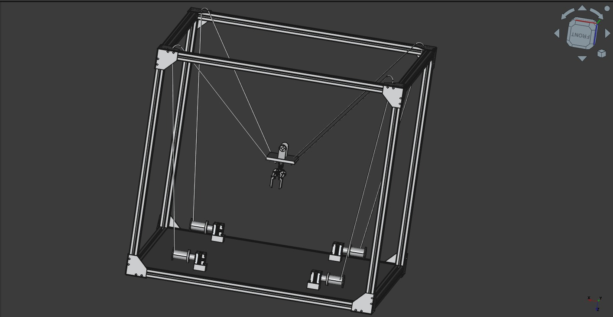

# Robotics Summer Project 2025-26

  
  
  
  

    
     
  

## 🤖 Project Overview

This repository houses the codebase for the Cable Driven Parallel Manipulator. It serves as a comprehensive collection of resources including research, calculations, code, CAD models, and component datasheets. Our aim is to create a well-documented reference that will enable future teams to build upon our work.

### 🎯 Design Goals
- ✅ Robust Design(Stability while operating)
- ✅ Stable Gripper for gripping objects
- ✅ Precise Inverse Kinematic calculations
- ✅ Fast operation

## 🧠 Algorithm Development
The Inverse Kinematics depends on the final configuration of cables, number of motors used and the mechanism used. Algorithms for Inverse Kinematics will be a novelty for this project.

## 📚 Resources

### Tools and References (tbd)

### Development Software
- Python
- Arduino IDE

## 🤝 Contributor Notes
- We follow the [standard Git workflow](https://www.geeksforgeeks.org/git-workflows-with-open-source-collaboration/) for collaboration
- Suggestions for improvement are welcome via **Issues** or Discussions.

---

